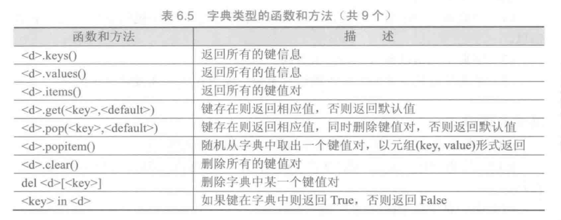

#### 1、Python保留字

#### 2、整数的进制表示

#### 3、Python内置运算符

#### 4、Python内置运算函数

#### 5、Python内置类型转换函数

#### 6、Python中math库函数

#### 7、Python中math库中幂函数

#### 8、Python中math库中三角函数

#### 9、Python中math库中高等特殊函数

#### 10、Python字符串基本操作

#### 11、Python内置字符串处理函数

#### 12、Python常用字符串处理方法

#### 13、Python关系操作符

#### 14、Python中random库常用函数

#### 15、Python中datetime类的常用属性及时间格式化方法

#### 16、Python中strftime方法的格式化控制符

#### 17、Python中序列类型的通用操作符和函数

#### 18、Python中集合类型的操作符

#### 19、Python中集合类型的操作函数或方法

#### 20、Python中列表特有的函数或方法

#### 21、Python中字典类型的函数和方法

#### 22、Python中jieba库常用的分词函数

